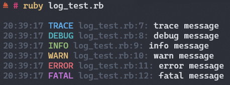

[](https://ko-fi.com/ualacecafe)

## What is LogRedux



LogRedux is a simple but rather customizable logging library for Ruby. It was completely inspired by [Log.c3](https://github.com/Its-Kenta/Log.c3).

## What LogRedux is not

LogRedux does not aim to be a replacement for _stdlib_'s Logger library - it's neither better nor more complete than it. Rather, LogRedux is simply another alternative for logging in your Ruby application.

## Installation

Get the `log_redux` gem by running:

```bash
gem install log_redux
```

Or add this line to your application's Gemfile:

```ruby
gem 'log_redux'
```

After installing the gem, add the following line to your application:

```ruby
require 'log_redux'
```

## API

### Creating a Logger

Create a logger by instantiating the `LogRedux::Logger` class:

```ruby
logger = LogRedux::Logger.new
```

`Logger.new` accepts the following options:
- `output_filename`: The name of the file to which the logger will write. Defaults to `$stderr`. Expects either a string, `$stdout` or `$stderr`.

The following arguments must be named:
- `color`: Whether the logger should colorize the output using ANSI color codes. Defaults to `true`.
- `timestamp`: Whether the logger should add a timestamp to the output. Defaults to `true`.
- `filename`: Whether the logger should add the name of the file from which the log was generated. Defaults to `true`.
- `track`: Whether to keep track internally of all logs emitted. Defaults to `false`.

For example:

```ruby
logger = LogRedux::Logger.new('log.txt', color: false, timestamp: true, filename: false, track: true)
```

> **Note**
>
> I recommend disabling `color` when logging to a file, as it will add ANSI color codes to the output, making it harder to read. If later you wish to read from the file and print these logs to the screen, its better to create two loggers, one for the file and one for the terminal ($stdout or $stderr).

### Logging

Log messages to `output_filename` using the following methods:

```ruby
logger.log(level, msg: msg)

# Internally, these call the `log` method:
logger.trace(msg)
logger.debug(msg)
logger.info(msg)
logger.warn(msg)
logger.error(msg)
logger.fatal(msg)
```

All the methods above return the formatted log message.

```ruby
x = logger.warn("Hi!") #=> x == "17:00:00 WARN test.rb:1: Hi!"
```

### Log Levels

LogRedux offers 6 different log levels:

- __"TRACE"__ (also _:TRACE_) - Used for verbose, fine-grained information of what is happening in your application or inside third-party libraries.
- __"DEBUG"__ (also _:DEBUG_) - Less verbose than __TRACE__. Used for messages needed for diagnosing and troubleshooting.
- __"INFO"__ (also _:INFO_) - The standard log level for regular events. Used for general information about the application's operation.
- __"WARN"__ (also _:WARN_) - Used for potentially harmful situations that are not necessarily errors.
- __"ERROR"__ (also _:ERROR_) - Used for errors preventing one or more operations from working properly.
- __"FATAL"__ (also _:FATAL_) - Used for unrecoverable errors that are fatal to crucial operations.

### History

If tracking is enabled, the logging history can be accessed via the `history` instance variable:

```ruby
p logger.history # This will always print [] if `track` is set to false
```

`history` is an array of hashes with the following keys:
- `:level`: The level of the log.
- `:time`: The timestamp of the log.
- `:filename`: The file from which the log was generated.
- `:line`: The line number where the log was generated.
- `:msg`: The message of the log.
- `:formatted`: The complete formatted log message.

For example:

```ruby
[
  {
    level: :TRACE,
    time: "17:00:00",
    filename: "test.rb",
    line: 1,
    msg: "Hello, world!",
    formatted: "17:00:00 INFO main.rb:1: Hello, world!" # Note that this example has `color` set to false, otherwise the ANSI color codes would be present.
  }
]
```

The methods `[]`, `first` and `last` can be used to get the formatted log of a given history entry. For the example above, all three would return the same thing:

```ruby
logger[0] # => "17:00:00 TRACE test.rb:1: Hello, world!"
logger.first # => "17:00:00 TRACE test.rb:1: Hello, world!"
logger.last # => "17:00:00 TRACE test.rb:1: Hello, world!"
```

If you wish to access the full detailed log for a specific entry, do it via the `history` instance variable:

```ruby
logger.history[0] # => {level: :TRACE, time: "17:00:00", filename: "test.rb", line: 1, msg: "Hello, world!", formatted: "17:00:00 INFO test.rb:1: Hello, world!"}
```

### Closing

Remember to always close a logger when you're done with it:

```ruby
logger.close
```

> **Note**
>
> `$stdout` and `$stderr` loggers should not be closed, and trying to do so will raise an error.

## Credits

As previously mentioned, thanks to [Its-Kenta](https://github.com/Its-Kenta) and his logging library [Log.c3](https://github.com/Its-Kenta/Log.c3) for the inspiration.
